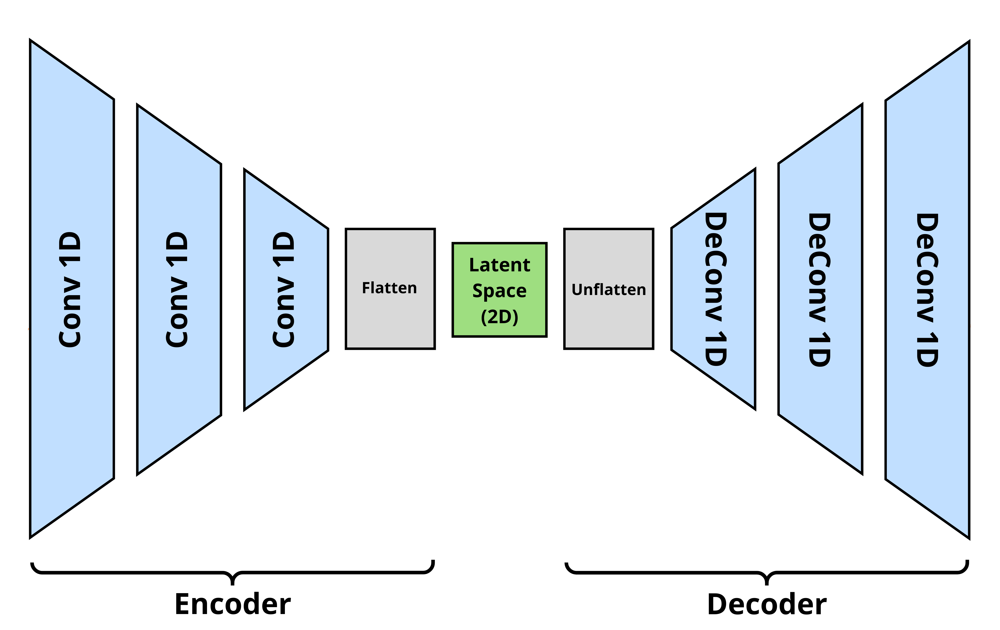
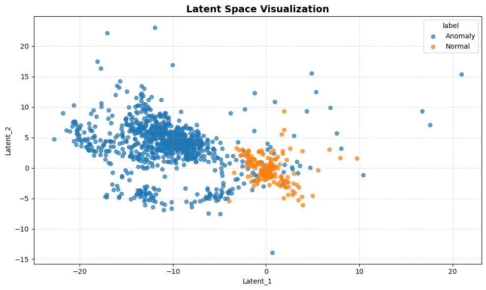
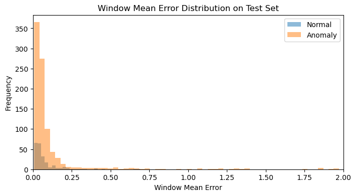

# ECG-bin-classifier

Unsupervised binary classification of ECG time series, comparing simple 
baselines against a Conv1D Autoencoder under both ideal 
and realistic (contaminated) training conditions.

## Note
This readme only reports some metrics and findings, but the methodology, model explanation 
and the explainability analysis of the results are shown in the `3_BaselineModels` and `5_AE_Results` notebooks.

## Dataset

The dataset consists of 5000 ECG time series of 140 points each, labeled as 
normal or as 4 different types of anomalies.
Check the `2_EDA` notebook for more info. 

Sample counts:
- Normal: 2919
- Anomaly: 2081

## Data Split

| Split        | Purpose                         |
|--------------|---------------------------------|
| Train        | Model fitting                   |
| Hyperparam   | Hyperparameter optimization     |
| Threshold    | Threshold calibration           |
| Test         | Final evaluation                |

See the `1_ETL` notebook for more details.

## Experiments

Two experimental conditions are evaluated:

1. **Pure experiment**: the training and hyperparam sets contain only normal samples, 
   representing an ideal curated scenario.
2. **Contaminated experiment**: 10% of the training and hyperparam sets are replaced by 
   anomalies, simulating a realistic scenario where labeling is imperfect/missing.

## Models

Three **unsupervised** models are compared:

- **Reference Subtraction**: a point-wise median and IQR are computed from 
  the training set. A new series is scored by the mean of its IQR-normalized 
  point-wise residuals against the reference.
- **Mahalanobis Distance**: each series is reduced to a vector of summary 
  statistics, and the Mahalanobis distance to the distribution of normal 
  samples is used as the anomaly score.
- **Conv1D Autoencoder**: a convolutional autoencoder trained to reconstruct 
  normal series. Reconstruction error is used as the anomaly score. 
  Hyperparameters are tuned with Optuna (see `4_AE_train.py` and `autoencoder/optuna_optim_3L.py`).
  The 3 layers Conv1d Autoencoder Architechture is shown below:

  

Threshold calibration methodology is detailed in notebooks `3_BaselineModels` 
and `5_AE_Results`.

## Results

### Pure experiment

The full explainability analysis for this experiment can be seen in notebooks `3_BaselineModels` 
and `5_AE_Results`.

| Model                 | Macro avg F1 | FN  | FP  |
|-----------------------|--------------|-----|-----|
| Reference Subtraction | 0.94         | 8   | 32  |
| Mahalanobis           | 0.91         | 47  | 23  |
| Conv1D Autoencoder    | **0.97**     | 1   | 17  |

In the ideal scenario, the autoencoder achieves the best performance, but 
the simple Reference Subtraction baseline is surprisingly competitive.

### Contaminated experiment (10%)

| Model                 | Macro avg F1 | FN    | FP  |
|-----------------------|--------------|-------|-----|
| Reference Subtraction | **0.93**     | 12    | 34  |
| Mahalanobis           | 0.86         | 53    | 47  |
| Conv1D Autoencoder    | 0.28         | 772   | 31  |

Under realistic contamination, the ranking changes. The 
Reference Subtraction baseline is nearly unaffected — the point-wise 
median has a 50% breakdown point and is essentially immune to 10% 
contamination. The autoencoder, on the other hand, performs poorly on the classification task.

### Why does the autoencoder fail for the contaminated experiment?

Despite the terrible F1 score, the autoencoder did **not** fail to learn. The latent space still shows a separation between normal and anomalous samples, indicating that discriminative information is retained:

What failed was the **detection criterion**: with contamination, the 
decoder learns to reconstruct anomalies alongside normal patterns, 
causing reconstruction errors to overlap across classes. The figure below — generated after metric computation, for explainability purposes only — illustrates this effect: the model learned to reconstruct both normal and anomalous patterns, resulting in overlapping reconstruction error distributions between the two classes.

## Conclusion

- Autoencoders are well suited to scenarios where normal samples exhibit 
  high intra-class variability, since they can learn to reconstruct 
  diverse normal patterns while failing on unseen anomalies. In this 
  ECG dataset, that assumption does not hold: normals are too uniform 
  and the AE's flexibility becomes a liability under contamination.
